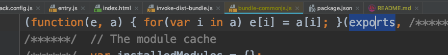

Webpack Config "libraryTarget" "commonjs" Demo
======================================

由于我们指定`libraryTarget`是`commonjs`，所以在生成的bundle文件中，
当webpack根据我们指定的entry.js生成了相应的自己持有的exports对象后，
还会把它的内容复制到全局的`exports`对象上。所以，当我们在node下require它时，
就能把它当作commonjs模块使用。



如图上所选择的`exports`就是全局的exports，也就是我们通常这么用的时候的exports:

```
exports.someVar = 'sdfsdf'
```

运行：

```
npm install
npm run demo
```
